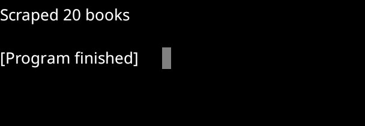

# 📚 BooksToScrape Web Scraper

Hi! This is a simple Python script I built to scrape book data from [BooksToScrape.com](https://books.toscrape.com), a site made for practicing web scraping. It collects book titles, prices, ratings, and links, then saves everything into a clean CSV file.

## 🔧 What It Does
- Scrapes book listings from page 1 of the site
- Extracts:
  - Title
  - Price
  - Rating
  - Link to product page
- Saves the data into `books.csv` using pandas

## 🛠️ Tools Used
- `requests` for fetching the HTML
- `BeautifulSoup` for parsing the page
- `pandas` for saving the data to CSV

## 🚀 How to Run It
1. Make sure you have Python installed
2. Install the required libraries:
    pip install requests beautifulsoup4 pandas
3. Run the script:
    python main.py   
4. Check your folder for `books.csv` — it’ll have all the scraped data

## 📦 Sample Output
Here’s what the CSV looks like:

| Title                        | Price  | Rating | Link                                      |
|-----------------------------|--------|--------|-------------------------------------------|
| It's Only the Himalayas     | £45.17 | Two    | https://books.toscrape.com/catalogue/...  |
| Sharp Objects               | £47.82 | Four   | https://books.toscrape.com/catalogue/...  |
## 🖼️ Script Output

Here’s a screenshot of the script running successfully:

 